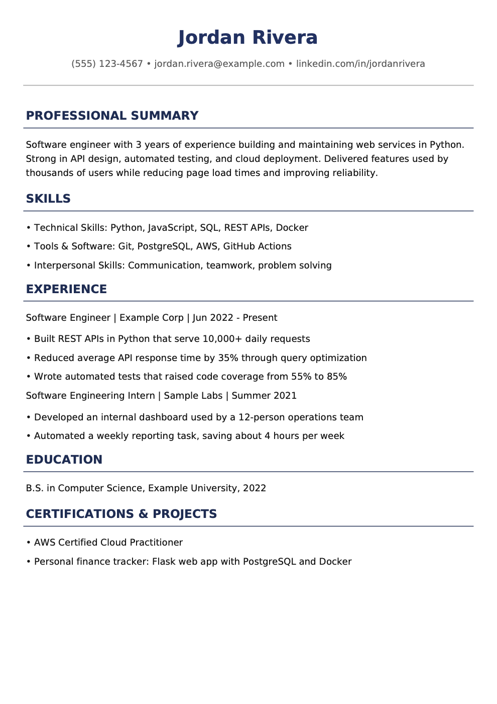

# resume-cover-gen

A command-line tool that generates a tailored, ATS-friendly resume and an optional cover letter as PDFs. You answer a few prompts about yourself and the target job, and an LLM (Llama 3.3 70B via the Groq API) writes the content, which is then rendered into a formatted PDF.

# Features

- Interactive prompts for contact details, skills, experience, education, and certifications
- Resume tailored to a target job title, in a fixed ATS-friendly section layout (summary, skills, experience, education, certifications/projects)
- Optional cover letter personalized from a company name and job description
- PDF export with a styled header and section dividers, using Unicode bullets when a font is available
- Loop mode: generate several resumes in one session
- Provider-agnostic: uses the OpenAI SDK, so any OpenAI-compatible API can be swapped in

# Example output

A resume generated from sample data (Jordan Rivera is fictional):



# How it works

1. `main.py` collects your details into a `User` object.
2. `PromptBuilder` turns that into a structured prompt for the resume (and, if requested, the cover letter).
3. The prompt is sent to the Groq chat completions API at a low temperature (0.4) for consistent output.
4. The response is normalized (bullets, blank lines) and parsed line by line into sections.
5. `ResumePDF` (built on `fpdf2`) renders the name, contact line, section headings, and bullets to a PDF.

# Requirements

- Python 3.9+
- A [Groq API key](https://console.groq.com/keys)
- Python packages: `openai`, `fpdf2`, `python-dotenv`

The [DejaVu Sans](https://dejavu-fonts.github.io/) fonts (`DejaVuSans.ttf`, `DejaVuSans-Bold.ttf`) are bundled in the repo for Unicode bullets; their license is in `DejaVu-LICENSE.txt`. If the font files are missing, the tool falls back to Helvetica and uses hyphens as bullets.

## Setup

```bash
git clone https://github.com/psanjith/resume-cover-gen.git
cd resume-cover-gen

python -m venv .venv
source .venv/bin/activate   # Windows: .venv\Scripts\activate

pip install openai fpdf2 python-dotenv
```

Create a `.env` file in the project root:

```
GROQ_API_KEY=your_key_here
```

`.env` is listed in `.gitignore`, so your key won't be committed.

## Usage

```bash
python main.py
```

The tool will ask for:

1. Full name, email, phone, LinkedIn, portfolio
2. Target job title and a short professional summary
3. Skills, work experience, and certifications/projects (one item per line, press Enter twice to finish each list)
4. Education summary
5. Company and job description (optional, for the cover letter)

Output files are written to the current directory:

- `<Your_Name>_resume.pdf`
- `<Your_Name>_cover_letter.pdf` (only if you provide a company or job description)

After each run you're asked whether to make another one.

## Configuration

Edit the constants at the top of [main.py](main.py):

| Setting | Default | Description |
| --- | --- | --- |
| `MODEL` | `llama-3.3-70b-versatile` | Model used for generation |
| `API_BASE` | `https://api.groq.com/openai/v1` | OpenAI-compatible API endpoint |

Because the client uses the OpenAI SDK, any OpenAI-compatible provider should work by changing these values and the API key.

## Project structure

```
resume-cover-gen/
├── main.py                # Prompts, LLM call, text cleanup, PDF rendering
├── DejaVuSans*.ttf        # Bundled fonts for Unicode bullets
├── DejaVu-LICENSE.txt     # Font license
├── docs/sample-resume.png # Example output shown above
├── .env                   # Your API key (not committed)
└── .gitignore
```

## Limitations

- Output quality depends on the input you give it. Vague input produces vague bullets.
- The prompts tell the model to stay within the details you provide, but LLMs can still embellish or invent specifics such as metrics. Always review the PDFs and correct anything inaccurate before sending them out.
- Responses are capped at 700 tokens, which can truncate long resumes or letters. Raise `max_tokens` in `generate_text` if that happens.
- Layout is a single fixed template; there is no theme or font customization beyond editing the `ResumePDF` class.
